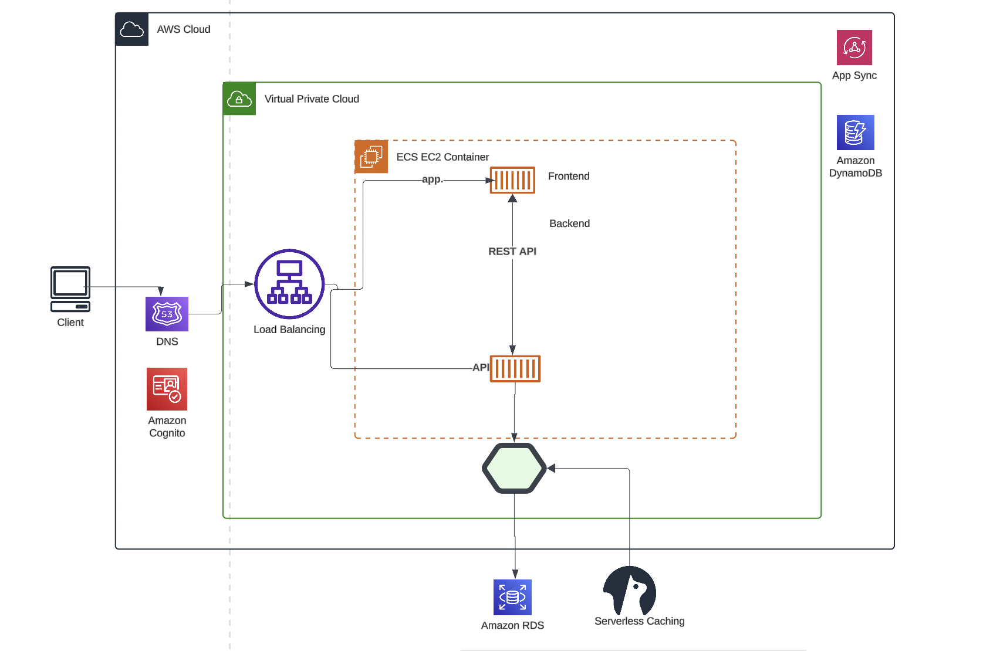

# Week 0 — Billing and Architecture

## Required Homework

### Installing AWS CLI

- I installed this successfully.

 ```
 aws-cli/2.15.25 Python/3.11.8 Darwin/21.2.0 source/arm64 prompt/off
 ```

```
azeezat@Abisolas-Air ~ % aws sts get-caller-identity
{
    "UserId": "xxxxxx",
    "Account": "xxxxx",
    "Arn": "arn:aws:iam::xxxxx:user/xxxx"
}
```

### Lucid Chart

